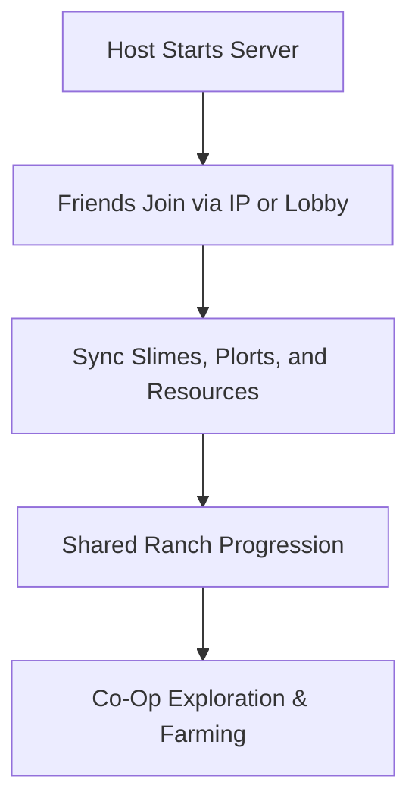

# Slime Rancher 2 Multiplayer Mod 🟣

**Slime Rancher 2** is a colorful, relaxing adventure full of exploration, farming, and slime collecting. While the base game is single-player only, the **Slime Rancher 2 Multiplayer Mod** opens the door for **co-op and shared ranching**, letting you and your friends farm, explore, and build side by side.

---

## 🌐 Overview

This fan-made mod introduces **multiplayer functionality** to the game. Players can host servers, join friends’ worlds, and share ranch progress. Syncing slime behavior, resources, and world events ensures the adventure feels alive and connected, while still keeping the cozy charm of the original game.

---

## 🔑 Features

* 👥 **Co-Op Multiplayer** – Play with friends in real-time.
* 🌍 **Server Hosting** – Host private or public sessions.
* 🏡 **Shared Ranching** – Manage corrals, gardens, and silos together.
* 🟢 **Resource Syncing** – Money, plorts, and upgrades shared across players.
* 🛠 **Custom Settings** – Adjust player caps, time cycles, and slime spawn rates.
* ⌨️ **Hotkey Menu** – Access multiplayer options instantly in-game.

---

[](#)
[](#)
[](#)
[](#)

---

## 🖥 Compatibility

| Platform       | Status        | Notes                       |
| -------------- | ------------- | --------------------------- |
| Windows 10     | ✅ Supported   | Stable multiplayer builds   |
| Windows 11     | ✅ Optimized   | Smoothest co-op performance |
| Linux (Proton) | ⚠️ Partial    | Some syncing issues         |
| macOS          | ❌ Unsupported | Requires VM workaround      |

\[!NOTE]
Both host and client players must install the mod for multiplayer to function correctly.

---

## ⚙️ Setup Guide

1. Download the **Slime Rancher 2 Multiplayer Mod**.

2. Extract into the game’s root folder.

3. Launch the Multiplayer Loader:

   ```bash
   slime_multiplayer.exe -mode host
   ```

   or to join a session:

   ```bash
   slime_multiplayer.exe -mode join -ip 192.168.x.x
   ```

4. Start the game and access the **Multiplayer Menu** with `F6`.

5. Configure lobby settings, player limits, and sync options.

\[!IMPORTANT]
Make sure all players have the **same game version** and mod build to avoid desyncs.

---

## 📊 Multiplayer Flow



---

## 🎚 Example Configurations

**Casual Co-Op:**

```ini
MaxPlayers=2
SharedCurrency=True
DayNightCycle=True
```

**Large Server:**

```ini
MaxPlayers=6
SharedCurrency=False
SlimeSpawnRate=High
```

**Private Farm Build:**

```ini
MaxPlayers=3
SharedCurrency=True
ResourcesSynced=True
```

\[!WARNING]
High player counts may cause desyncs or performance drops—use moderate caps for stability.

---

## ❓ FAQ

**Q: Does this mod work on Steam and Xbox versions?**
A: Steam version supported; Xbox Game Pass is not.

**Q: Can I save progress in multiplayer?**
A: Yes, host progress is saved and shared with connected players.

**Q: Is crossplay supported?**
A: Not currently—Windows PC only.

**Q: Do slimes sync properly between players?**
A: Yes, slime AI and physics are synced in multiplayer.

**Q: Will updates follow official patches?**
A: The mod is updated alongside major game patches.

---

## 🚀 Final Thoughts

The **Slime Rancher 2 Multiplayer Mod** transforms the solo farming adventure into a **shared co-op experience**. From raising slimes together to exploring vibrant biomes with friends, it’s the perfect way to enjoy Beatrix’s journey with others.

[](#)
[](#)
[](#)

---
